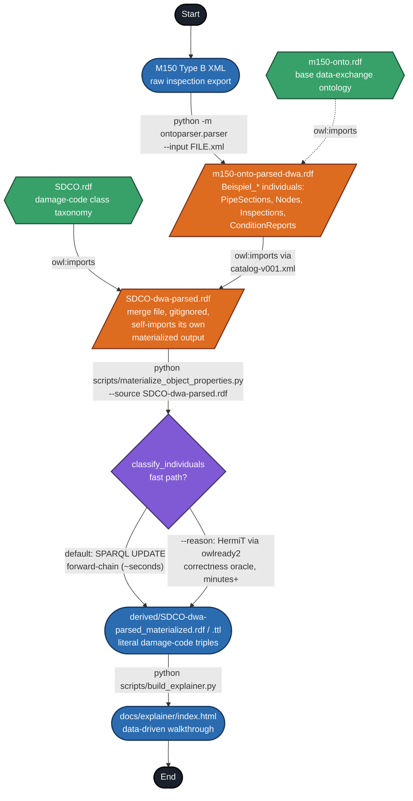

# SDCO — Sewer Damage Classification Ontology

An OWL ontology formalizing **DIN EN 13508-2**, the European coding system for visual inspection of drains/sewers (damage, characterization, inventory/observation codes — ~80 codes total). Source standard: `docs/DIN EN 13508-2 ENGLISH.pdf`.

SDCO complements [m150-onto](../m150-onto), a sibling ontology modeling the DWA M150 data-exchange format (pipe sections, nodes, inspection/condition reports as OWL individuals). Where m150-onto stores condition-report data as literal codes (`hasConditionCode "BAB"`), SDCO gives those codes semantic meaning as a damage-code class taxonomy (`:BAB` ⊑ `Fissure`, etc.) via `owl:imports`, resolved locally through `catalog-v001.xml`.

Full design narrative, competency questions, and SPARQL/SHACL examples: `docs/Sewer Damage Classification Ontology SDCO.md`.

## Repository layout

- `SDCO.rdf` — the ontology (Turtle syntax despite the `.rdf` extension).
- `SDCO-dwa-parsed.rdf` — SDCO merged with m150-onto-parsed example/test data.
- `catalog-v001.xml` — OASIS XML catalog resolving `owl:imports` to the local m150-onto file.
- `derived/` — generated output only (materialized triples). Never hand-edit; regenerate via scripts.
- `benchmark/` — lightweight dataset for fast iteration on materialization.
- `docs/` — design docs, the DIN EN 13508-2 standard, refactor/handover writeups.
- `scripts/` — maintenance and materialization scripts (`scripts/obsolete/` holds one-time recovery scripts kept for history).

## Modeling approach

Damage codes are modeled as **OWL classes** (branch `dev-classes_approach`), not individuals: `owl:equivalentClass` matches literal condition-report codes, and `rdfs:subClassOf` restrictions use `owl:someValuesFrom` to place damage-code classes into their taxonomy. This lets HermiT-style subsumption reasoning work automatically without punning.

## Class hierarchy

```
owl:Thing
├── Observation                — root of all coded findings
│   ├── Cause                  — why a defect/observation occurred (mechanical, chemical, equipment failure...)
│   ├── Defect                 — anything wrong found during inspection
│   │   ├── OperationalDefect  — functional problems (blockages, infiltration, roots, deposits...)
│   │   └── StructuralDefect   — physical damage to the pipe/node fabric (cracks, deformation, collapse...)
│   ├── Inventory               — non-defect features recorded for the asset (connections, node type, repairs)
│   ├── Location                — positional qualifiers for a finding
│   ├── Orientation             — clock-position/directional qualifiers (left, down, circumferential...)
│   └── OtherObservation        — miscellaneous codes DIN EN 13508-2 buckets as "Other" (photos, remarks, termination...)
└── Reference                   — DIN EN 13508-2 damage/feature codes themselves (BAA, BBA, DAB, ...)
    ├── NodeFabric               — structural/fabric condition codes for nodes (manholes, inspection chambers)
    ├── NodeInventory             — inventory/feature codes recorded for nodes (type, dimensions, materials)
    ├── NodeOperation             — operational condition codes for nodes (blockages, deposits, infiltration)
    ├── NodeOther                 — miscellaneous node codes DIN EN 13508-2 buckets as "Other"
    ├── PipeFabric                — structural/fabric condition codes for pipe sections
    ├── PipeInventory             — inventory/feature codes recorded for pipe sections (connections, linings, repairs)
    ├── PipeOperation             — operational condition codes for pipe sections
    └── PipeOther                 — miscellaneous pipe codes DIN EN 13508-2 buckets as "Other"
```

Each `Reference` code class (e.g. `:BAA`) is `owl:equivalentClass` to a literal `hasConditionCode` value and `rdfs:subClassOf` a `someValuesFrom` restriction pointing into the `Observation` tree above (e.g. `:BAA` ⊑ `hasPipeFabricDamage some :Deformation`) — that's how a raw code gets its semantic meaning. The full code list isn't reproduced here; see `SDCO.rdf` or `docs/Sewer Damage Classification Ontology SDCO.md`.

> Classes imported directly from `m150-onto` (e.g. `ConditionReport`, individuals for pipe sections/nodes) aren't part of this hierarchy — see the sibling [m150-onto](../m150-onto) repo for those.

## Data pipeline: M150 XML → materialized triples



Legend: **blue rounded** = pipeline input/output files, **orange parallelogram** = generated intermediate data, **green hexagon** = the two source ontologies, **purple diamond** = the materialization decision step.

**Steps:**

1. **Parse the raw XML** (in the sibling [m150-onto](../m150-onto) repo): `python -m ontoparser.parser --input <file.xml>` reads the DWA M150 Type B export and, via a CSV-driven mapping + six-stage entity resolution, creates `Beispiel_`-prefixed OWL individuals. The output is a diff-only file (`owl:imports` the base `m150-onto.rdf` rather than duplicating it).
2. **Merge with SDCO**: `SDCO-dwa-parsed.rdf` (gitignored, local-only) `owl:imports` both `SDCO.rdf` and the parsed m150 individuals — `catalog-v001.xml` resolves both imports to local files so nothing needs a network fetch.
3. **Materialize** (below) — realize each individual's damage-code classification and emit literal triples the `someValuesFrom` restrictions alone can't produce.
4. **Explainer** (optional) — `build_explainer.py` turns the materialized data into a browsable HTML walkthrough.

For fast local iteration, `scripts/make_benchmark_dataset.py` + `benchmark/catalog-lite.xml` substitute a 23-report lightweight dataset for steps 1–3.

## Materialization

`someValuesFrom` restrictions are existential, so reasoning alone never yields a literal, queryable triple for the filler. `scripts/materialize_object_properties.py` closes that gap, producing `derived/*_materialized.rdf`/`.ttl`:

```bash
python scripts/materialize_object_properties.py --source SDCO-dwa-parsed.rdf
```

By default it forward-chains the `equivalentClass` patterns directly (seconds). Pass `--reason` to instead run the original HermiT path via `owlready2` as a correctness oracle (minutes+).

## Explainer

`docs/explainer/` is a self-contained HTML walkthrough of the ontology, built from real data (not hand-typed numbers). `scripts/build_explainer.py` extracts stats/examples from `SDCO.rdf` + the m150 example dataset into `docs/explainer/sdco_data.json`, then injects that JSON into `docs/explainer/template.html` to produce `docs/explainer/index.html`.

```bash
python scripts/build_explainer.py
```

Don't open `index.html` via `file://` — browsers treat `file://` pages as unique security origins, which breaks things. Serve it over localhost instead:

```bash
cd docs/explainer
python -m http.server 8000
```

Then visit `http://localhost:8000/index.html`.

See `CLAUDE.md` for full agent-facing context, including current namespace state, working notes, and script details.
